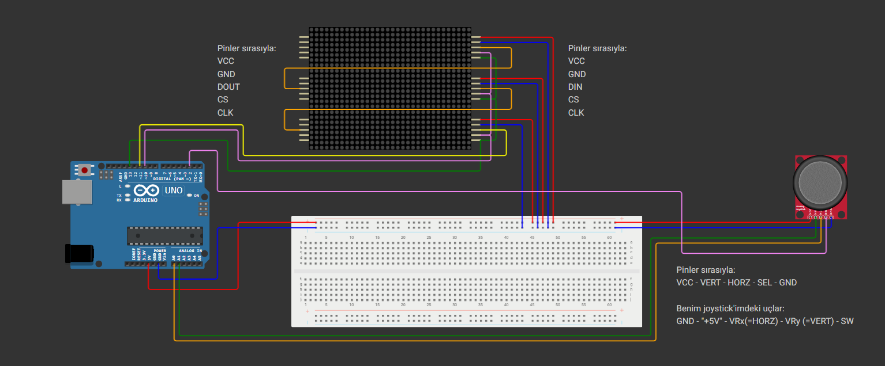

# 🎮 Tetris Game With Arduino

<div align="center">

**8x24 LED Kule Ekranında Klasik Tetris | Classic Tetris on 8x24 LED Tower Display**

*Arduino Uno + MAX7219 LED Matris Modülleri + Analog Joystick*


[🇹🇷 Türkçe](#-proje-hakkında) • [🇬🇧 English](#-about-the-project)

</div>

---

# 🇹🇷 TÜRKÇE

## 📝 Proje Hakkında

Bu proje, klasik Tetris oyununun Arduino tabanlı donanım üzerinde çalışan **dikey bir versiyonudur**. Standart yatay ekranlar yerine, 3 adet MAX7219 LED Matris modülü dikey olarak birbirine bağlanarak **8x24 piksellik bir kule ekranı** oluşturulmuştur.

Oyun kontrolü, buton yerine **Analog Joystick** ile sağlanarak daha akıcı bir deneyim hedeflenmiştir. Kod yapısında, ekran titremesini önlemek için **"Render on Change"** (Sadece değişimde çiz) tekniği kullanılmış ve oyun hızı, zorluk seviyesine göre dinamik olarak artırılmıştır.

### 🎯 Proje Hedefleri:

- Fiziksel, donanım tabanlı bir Tetris oyunu oluşturmak
- SPI haberleşmesi ve LED matris kontrolünü öğrenmek
- Verimli render algoritmaları geliştirmek
- Eğlenceli, interaktif bir embedded sistem projesi yapmak

### ✨ Öne Çıkan Özellikler:

- 🎯 **Dikey Oynanış**: 8x24 LED Kule ile gerçek Tetris deneyimi
- 🕹️ **Analog Joystick Kontrolü**: Butonlardan daha hassas ve akıcı hareket
- 🎨 **Titremesiz Görüntü**: Render on Change algoritması ile flicker-free ekran
- ⚡ **Dinamik Zorluk**: Oyun ilerledikçe artan hız
- 🔄 **Yumuşak Döndürme**: Debounce korumalı yumuşak döndürme
- 📊 **Satır Silme Animasyonu**: Dolu satırlar animasyonla silinir
- 🎮 **7 Klasik Tetris Şekli**: I, J, L, O, S, T, Z şekilleri
- ⚙️ **SPI Zincirleme Bağlantı**: Zincirleme bağlı modüllerle Arduino pinlerinin verimli kullanımı

---

## 🎥 Demo Video:

<div align="center">

### Oyun Görüntüsü

https://github.com/user-attachments/assets/sample-video.mp4

*Projenin çalışır halinin demo videosu*

</div>

---

## 🛠️ Donanım Gereksinimleri

| Bileşen | Miktar | Açıklama |
|---------|--------|----------|
| **Arduino Uno/Nano** | 1x | Ana kontrol kartı |
| **MAX7219 8x8 LED Matris** | 3x | Zincirleme bağlı ekran modülleri |
| **Analog Joystick Modülü** | 1x | XY eksenli + buton |
| **Jumper Kablolar** | - | Erkek-erkek bağlantı kabloları |
| **Breadboard** | 1x | (Opsiyonel) Prototip için |

### 💰 Tahmini Maliyet

Tahmini toplam maliyet: **~15-20$** (Tüm bileşenler dahil)

---

## 🔌 Devre Şeması

<div align="center">



</div>

### Bağlantı Detayları

#### 1️⃣ Güç Hattı

Tüm bileşenler ortak güç hattından beslenir.

```
Arduino 5V  → Tüm Modüllerin VCC + Joystick VCC
Arduino GND → Tüm Modüllerin GND + Joystick GND
```

#### 2️⃣ LED Matris Bağlantısı (Zincirleme)

3 modül birbirine zincirleme bağlıdır. Arduino'ya en yakın modül (en alt) = **Modül 1**

| Arduino Pin | Modül Pin | Açıklama |
|-------------|-----------|----------|
| `Pin 13` | `CLK` | Tüm modüllerin CLK pinine paralel |
| `Pin 10` | `CS (LOAD)` | Tüm modüllerin CS pinine paralel |
| `Pin 11` | `DIN` | **Sadece 1. modülün DIN pinine** |

**📡 Veri Akışı:**
```
Arduino (Pin 11) → Modül 1 (DIN)
                   Modül 1 (DOUT) → Modül 2 (DIN)
                                     Modül 2 (DOUT) → Modül 3 (DIN)
```

#### 3️⃣ Joystick Bağlantısı

| Arduino Pin | Joystick Pin | İşlevi |
|-------------|--------------|--------|
| `A0` | `HORZ / VRX` | 🔄 Sağa-Sola hareket |
| `A1` | `VERT / VRY` | ⬇️ Hızlı düşme (Soft Drop) |
| `Pin 2` | `SEL / SW` | 🔃 Blok döndürme (90°) |

---

## 📥 Kurulum

### 1. Arduino IDE Kurulumu

1. [Arduino IDE](https://www.arduino.cc/en/software) indirin ve kurun
2. Arduino'yu USB ile bilgisayara bağlayın

### 2. Kütüphane Kurulumu

Gerekli kütüphane: **LedControl** (MAX7219 kontrolü için)

**Arduino IDE üzerinden:**
```
Sketch → Include Library → Manage Libraries
Arama: "LedControl"
Yazar: Eberhard Fahle
→ Install
```

**Veya manuel olarak:**
```bash
# Kütüphaneyi klonlayın
git clone https://github.com/wayoda/LedControl.git
# Arduino kütüphaneler klasörüne kopyalayın
```

### 3. Kod Yükleme

1. `sketch_nov27a/sketch_nov27a.ino` dosyasını Arduino IDE ile açın
2. **Tools → Board** → Arduino Uno/Nano seçin
3. **Tools → Port** → COM portunu seçin
4. **Upload** butonuna basın (➡️)

### 4. Fiziksel Montaj

⚠️ **ÖNEMLİ**: Oyun için breadboard'u **DİKEY (portre)** tutmalısınız!

```
      [Modül 3] ← En Üst
          ↑
      [Modül 2] ← Orta
          ↑
      [Modül 1] ← En Alt (Arduino'ya en yakın)
          ↑
      [Arduino]
```

---

## 🎮 Nasıl Oynanır?

| Kontrol | Aksiyon |
|---------|---------|
| 🕹️ **Joystick Sola** | Bloğu sola hareket ettir |
| 🕹️ **Joystick Sağa** | Bloğu sağa hareket ettir |
| 🕹️ **Joystick Aşağı** | Hızlı düşme (Soft Drop) |
| 🔘 **Joystick Butonu** | Bloğu 90° döndür |

### Oyun Mekanikleri

- ✅ **Satır Doldurma**: Tam dolu satırlar otomatik silinir
- ⚡ **Zorluk**: Her silinen satırda oyun hızlanır
- 🎯 **Hedef**: Bloklar tavana ulaşmadan maksimum satır silme
- 🎮 **Oyun Bitişi**: Bloklar tavana ulaştığında oyun sıfırlanır

---

## ⚙️ Teknik Detaylar

### Yazılım Mimarisi

#### 🎨 Render on Change Algoritması

Ekran sadece oyun durumu değiştiğinde güncellenir, titremeyi önler:

```cpp
// Ekran sürekli yenilenmez → Titreme önlenir
// Sadece blok hareket ettiğinde ekran güncellenir
if (updateScreen) {
    renderGame();
    updateScreen = false;
}
```

#### 📐 Koordinat Sistemi

Fiziksel olarak ayrı 3 modül, yazılımsal olarak **tek bir 8x24 koordinat düzlemi** gibi çalışır:

```
Y: 0-7   → Modül 1 (Alt)
Y: 8-15  → Modül 2 (Orta)
Y: 16-23 → Modül 3 (Üst)
```

#### 🔄 Joystick Kalibrasyon Değerleri

```cpp
// X Ekseni (Sağ-Sol)
if (analogRead(A0) < 200)  → Sola
if (analogRead(A0) > 800)  → Sağa

// Y Ekseni (Hızlı Düşme)
if (analogRead(A1) > 800)  → Aşağı (Soft Drop)

// Buton (Döndürme)
digitalRead(2) == LOW      → 90° Döndür
```

#### 🛡️ Debounce Koruması

```cpp
// Buton ark atlamasını önleme
unsigned long debounceDelay = 250; // ms
```

#### 🎯 Satır Silme Algoritması

```cpp
// Byte değeri 255 = Satır tamamen dolu
for (int row = 0; row < SCREEN_HEIGHT; row++) {
    if (board[row] == 255) {
        clearLine(row); // Animasyon ile sil
        shiftDown(row); // Üst satırları aşağı kaydır
    }
}
```

### Kullanılan Teknolojiler

- 🔧 **Kütüphane**: LedControl.h (SPI haberleşmesi)
- 💻 **Programlama**: C++ (Arduino)
- 🎮 **Donanım Protokolü**: SPI (Serial Peripheral Interface)
- 📟 **Ekran Sürücüsü**: MAX7219
- 🎯 **Oyun Mantığı**: Özel Tetris implementasyonu

---

## 📂 Proje Yapısı

```
Tetris-Game-With-Arduino/
│
├── sketch_nov27a/
│   └── sketch_nov27a.ino      # Ana Arduino kodu
│
├── diagram-image/
│   └── circuit_diagram.png    # Devre şeması
│
├── sample/
│   └── sample-video.mp4       # Demo video
│
└── README.md                  # Bu dosya
```

---

## 🐛 Sorun Giderme

### Ekran Yanmıyor

- ✅ 5V ve GND bağlantılarını kontrol edin
- ✅ Modüllerin CLK, CS, DIN pinlerini doğrulayın
- ✅ LedControl kütüphanesinin yüklü olduğundan emin olun
- ✅ Modüllerin düzgün zincirleme bağlı olduğunu kontrol edin

### Joystick Çalışmıyor

- ✅ VRX → A0, VRY → A1 bağlantısını kontrol edin
- ✅ Joystick buton pininin Pin 2'ye bağlı olduğunu doğrulayın
- ✅ Serial Monitor'dan analog değerleri okuyun (0-1023 arası)
- ✅ Joystick'i Serial Monitor ile test edin

### Bloklar Ters Yönde Hareket Ediyor

- ✅ Joystick yön kalibrasyonunu koddaki < ve > işaretlerini ters çevirerek ayarlayın
- ✅ Modüllerin fiziksel sırasını kontrol edin (Alt→Üst)
- ✅ Joystick'in ters bağlı olmadığını kontrol edin

### Ekran Titriyor

- ✅ Render on Change algoritmasının doğru çalıştığından emin olun
- ✅ Güç kaynağının yeterli akımı sağladığını kontrol edin (~200mA)
- ✅ Ekran parlaklığını azaltmayı deneyin: `lc.setIntensity(i, 2);`

### Oyun Başlamıyor

- ✅ Kodun başarıyla yüklendiğini kontrol edin
- ✅ Tüm bağlantıların sağlam olduğunu doğrulayın
- ✅ Arduino'yu sıfırlayın ve Serial Monitor'da hataları kontrol edin

---

## 🚀 Geliştirme Fikirleri

- [ ] Skor tablosu (7-segment display)
- [ ] Ses efektleri (Buzzer modülü)
- [ ] Seviye göstergesi
- [ ] Duraklat/Devam özelliği
- [ ] Yüksek skor kaydı (EEPROM)
- [ ] Ghost piece (bloğun düşeceği yerin gösterimi)
- [ ] Sonraki parça önizlemesi
- [ ] Çok oyunculu mod
- [ ] Farklı oyun modları

---

## 📸 Ekran Görüntüleri

> Bu bölümü gerçek projenizin fotoğraflarıyla güncelleyebilirsiniz

```
📷 Kurulmuş proje fotoğrafları
📷 Oyun anı ekran görüntüleri
📷 Devre bağlantı detayları
```

---

## 🤝 Katkıda Bulunma

Katkılarınızı bekliyorum! Lütfen:

1. 🍴 Bu repo'yu fork edin
2. 🔨 Yeni bir branch oluşturun (`git checkout -b feature/YeniOzellik`)
3. 💾 Değişikliklerinizi commit edin (`git commit -m 'Yeni özellik eklendi'`)
4. 📤 Branch'inizi push edin (`git push origin feature/YeniOzellik`)
5. 🔃 Pull Request açın

---

## 🎓 Öğrendiklerim

Bu proje sayesinde:

- ✅ MAX7219 LED Matris kontrolünü
- ✅ SPI haberleşme protokolünü
- ✅ Analog sensör okumayı (Joystick)
- ✅ Oyun döngüsü ve state management
- ✅ Render optimization tekniklerini
- ✅ Debounce algoritmasını
- ✅ Donanım-yazılım entegrasyonunu
- ✅ Embedded sistem programlamayı öğrendim

---

## 🙏 Teşekkürler

Bu projeyi geliştirirken yardımcı olan kaynaklara teşekkürler:

- Arduino Community
- LedControl Library (Eberhard Fahle)
- Tetris Game Logic References
- Tüm katkıda bulunanlar ve test edenler

---

# 🇬🇧 ENGLISH

## 📝 About The Project

This project is a **vertical version** of the classic Tetris game running on Arduino-based hardware. Instead of standard horizontal displays, 3 MAX7219 LED Matrix modules are connected vertically to create an **8x24 pixel tower display**.

Game control is provided via an **Analog Joystick** instead of buttons for a smoother experience. The code structure uses a **"Render on Change"** technique to prevent screen flickering, and the game speed increases dynamically based on difficulty level.

### 🎯 Project Goals:

- Create a physical, hardware-based Tetris game
- Learn SPI communication and LED matrix control
- Implement efficient rendering algorithms
- Build a fun, interactive embedded system project

### ✨ Key Features:

- 🎯 **Vertical Gameplay**: Real Tetris experience on 8x24 LED Tower
- 🕹️ **Analog Joystick Control**: More precise and smooth movement than buttons
- 🎨 **Flicker-Free Display**: Render on Change algorithm eliminates screen flickering
- ⚡ **Dynamic Difficulty**: Game speed increases as you progress
- 🔄 **Smooth Rotation**: Debounce-protected smooth block rotation
- 📊 **Line Clear Animation**: Filled rows are cleared with animation
- 🎮 **7 Classic Tetris Pieces**: I, J, L, O, S, T, Z shapes
- ⚙️ **SPI Daisy Chain**: Efficient use of Arduino pins with chained modules

---

## 🎥 Demo Video

<div align="center">

### Gameplay Video

https://github.com/user-attachments/assets/sample-video.mp4

*Demo video of the project in action*

</div>

---

## 🛠️ Hardware Requirements

| Component | Quantity | Description |
|-----------|----------|-------------|
| **Arduino Uno/Nano** | 1x | Main controller board |
| **MAX7219 8x8 LED Matrix** | 3x | Daisy-chain connected display modules |
| **Analog Joystick Module** | 1x | XY axis + button |
| **Jumper Wires** | - | Male-to-male connection wires |
| **Breadboard** | 1x | (Optional) For prototyping |

### 💰 Estimated Cost

Total estimated cost: **~$15-20** (All components included)

---

## 🔌 Circuit Diagram

<div align="center">


</div>

### Connection Details

#### 1️⃣ Power Bus

All components are powered from a common power bus.

```
Arduino 5V  → All Modules VCC + Joystick VCC
Arduino GND → All Modules GND + Joystick GND
```

#### 2️⃣ LED Matrix Connection (Daisy Chain)

3 modules are connected in a chain. The module closest to Arduino (bottom) = **Module 1**

| Arduino Pin | Module Pin | Description |
|-------------|------------|-------------|
| `Pin 13` | `CLK` | Parallel to all modules' CLK pins |
| `Pin 10` | `CS (LOAD)` | Parallel to all modules' CS pins |
| `Pin 11` | `DIN` | **Only to Module 1's DIN pin** |

**📡 Data Flow:**
```
Arduino (Pin 11) → Module 1 (DIN)
                   Module 1 (DOUT) → Module 2 (DIN)
                                     Module 2 (DOUT) → Module 3 (DIN)
```

#### 3️⃣ Joystick Connection

| Arduino Pin | Joystick Pin | Function |
|-------------|--------------|----------|
| `A0` | `HORZ / VRX` | 🔄 Left-Right movement |
| `A1` | `VERT / VRY` | ⬇️ Fast drop (Soft Drop) |
| `Pin 2` | `SEL / SW` | 🔃 Block rotation (90°) |

---

## 📥 Installation

### 1. Arduino IDE Setup

1. Download and install [Arduino IDE](https://www.arduino.cc/en/software)
2. Connect Arduino to your computer via USB

### 2. Library Installation

Required library: **LedControl** (for MAX7219 control)

**Via Arduino IDE:**
```
Sketch → Include Library → Manage Libraries
Search: "LedControl"
Author: Eberhard Fahle
→ Install
```

**Or manually:**
```bash
# Clone the library
git clone https://github.com/wayoda/LedControl.git
# Copy to Arduino libraries folder
```

### 3. Upload Code

1. Open `sketch_nov27a/sketch_nov27a.ino` file in Arduino IDE
2. **Tools → Board** → Select Arduino Uno/Nano
3. **Tools → Port** → Select your COM port
4. Click **Upload** button (➡️)

### 4. Physical Assembly

⚠️ **IMPORTANT**: The breadboard must be held **VERTICALLY (portrait)** for the game!

```
      [Module 3] ← Top
          ↑
      [Module 2] ← Middle
          ↑
      [Module 1] ← Bottom (closest to Arduino)
          ↑
      [Arduino]
```

---

## 🎮 How to Play

| Control | Action |
|---------|--------|
| 🕹️ **Joystick Left** | Move block left |
| 🕹️ **Joystick Right** | Move block right |
| 🕹️ **Joystick Down** | Fast drop (Soft Drop) |
| 🔘 **Joystick Button** | Rotate block 90° |

### Game Mechanics

- ✅ **Line Clearing**: Fully filled rows are automatically cleared
- ⚡ **Difficulty**: Game speeds up with each cleared line
- 🎯 **Objective**: Clear maximum lines before blocks reach the top
- 🎮 **Game Over**: Game resets when blocks reach the top

---

## ⚙️ Technical Details

### Software Architecture

#### 🎨 Render on Change Algorithm

The display is only updated when the game state changes, preventing flickering:

```cpp
// Screen is not constantly refreshed → Prevents flickering
// Display updates only when block moves
if (updateScreen) {
    renderGame();
    updateScreen = false;
}
```

#### 📐 Coordinate System

Physically separate 3 modules work as a **single 8x24 coordinate plane** in software:

```
Y: 0-7   → Module 1 (Bottom)
Y: 8-15  → Module 2 (Middle)
Y: 16-23 → Module 3 (Top)
```

#### 🔄 Joystick Calibration Values

```cpp
// X Axis (Left-Right)
if (analogRead(A0) < 200)  → Left
if (analogRead(A0) > 800)  → Right

// Y Axis (Fast Drop)
if (analogRead(A1) > 800)  → Down (Soft Drop)

// Button (Rotation)
digitalRead(2) == LOW      → 90° Rotate
```

#### 🛡️ Debounce Protection

```cpp
// Prevents button bounce/ghost presses
unsigned long debounceDelay = 250; // ms
```

#### 🎯 Line Clearing Algorithm

```cpp
// Byte value 255 = Row completely filled
for (int row = 0; row < SCREEN_HEIGHT; row++) {
    if (board[row] == 255) {
        clearLine(row); // Clear with animation
        shiftDown(row); // Shift upper rows down
    }
}
```

### Technologies Used

- 🔧 **Library**: LedControl.h (SPI communication)
- 💻 **Programming**: C++ (Arduino)
- 🎮 **Hardware Protocol**: SPI (Serial Peripheral Interface)
- 📟 **Display Driver**: MAX7219
- 🎯 **Game Logic**: Custom Tetris implementation

---

## 📂 Project Structure

```
Tetris-Game-With-Arduino/
│
├── sketch_nov27a/
│   └── sketch_nov27a.ino      # Main Arduino code
│
├── diagram-image/
│   └── circuit_diagram.png    # Circuit diagram
│
├── sample/
│   └── sample-video.mp4       # Demo video
│
└── README.md                  # This file
```

---

## 🐛 Troubleshooting

### Display Not Working

- ✅ Check 5V and GND connections
- ✅ Verify modules' CLK, CS, DIN pins
- ✅ Ensure LedControl library is installed
- ✅ Check if modules are properly daisy-chained

### Joystick Not Working

- ✅ Verify VRX → A0, VRY → A1 connections
- ✅ Confirm joystick button pin is connected to Pin 2
- ✅ Read analog values from Serial Monitor (should be 0-1023)
- ✅ Test joystick with Serial Monitor to see raw values

### Blocks Moving in Wrong Direction

- ✅ Adjust joystick direction calibration by reversing < and > signs in code
- ✅ Check physical order of modules (Bottom→Top)
- ✅ Verify joystick is not inverted

### Screen Flickering

- ✅ Ensure Render on Change algorithm is working correctly
- ✅ Check if power supply provides sufficient current (all modules need ~200mA)
- ✅ Try reducing display intensity: `lc.setIntensity(i, 2);`

### Game Not Starting

- ✅ Check if code uploaded successfully
- ✅ Verify all connections are secure
- ✅ Reset Arduino and check Serial Monitor for errors

---

## 🚀 Future Improvements

- [ ] Score display (7-segment display)
- [ ] Sound effects (Buzzer module)
- [ ] Level indicator
- [ ] Pause/Resume feature
- [ ] High score saving (EEPROM)
- [ ] Ghost piece (showing where block will land)
- [ ] Next piece preview
- [ ] Multiplayer mode
- [ ] Different game modes

---

## 📸 Screenshots

> Update this section with your actual project photos

```
📷 Assembled project photos
📷 Gameplay screenshots
📷 Circuit connection details
```

---

## 🤝 Contributing

Contributions are welcome! Please:

1. 🍴 Fork this repository
2. 🔨 Create a new branch (`git checkout -b feature/NewFeature`)
3. 💾 Commit your changes (`git commit -m 'Add new feature'`)
4. 📤 Push to the branch (`git push origin feature/NewFeature`)
5. 🔃 Open a Pull Request

---

## 🎓 What I Learned

Through this project, I learned:

- ✅ MAX7219 LED Matrix control
- ✅ SPI communication protocol
- ✅ Analog sensor reading (Joystick)
- ✅ Game loop and state management
- ✅ Render optimization techniques
- ✅ Debounce algorithm implementation
- ✅ Hardware-software integration
- ✅ Embedded systems programming

---

## 🙏 Acknowledgments

Thanks to the resources that helped during development:

- Arduino Community
- LedControl Library (Eberhard Fahle)
- Tetris Game Logic References
- All contributors and testers

---

<div align="center">

**⭐ Bu projeyi beğendiyseniz yıldız vermeyi unutmayın! ⭐**

**⭐ If you liked this project, don't forget to give it a star! ⭐**

Made with ❤️ and Arduino

[⬆ Yukarı Çık | Back to Top](#-tetris-game-with-arduino)

</div>
